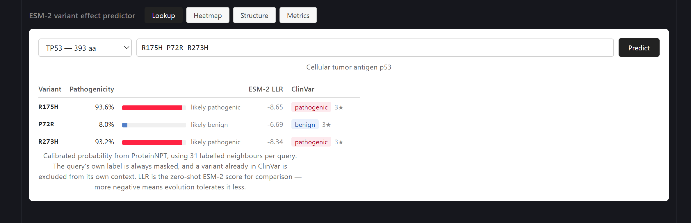
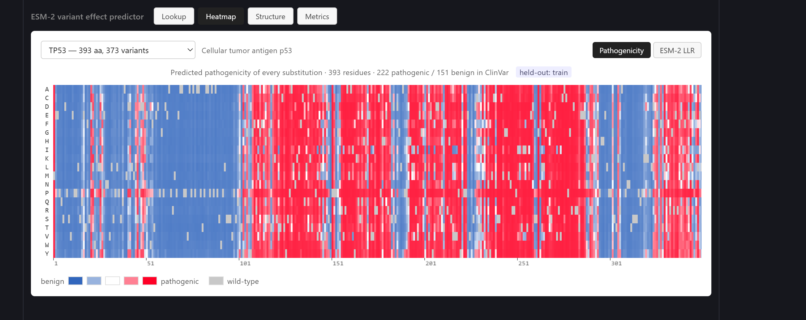
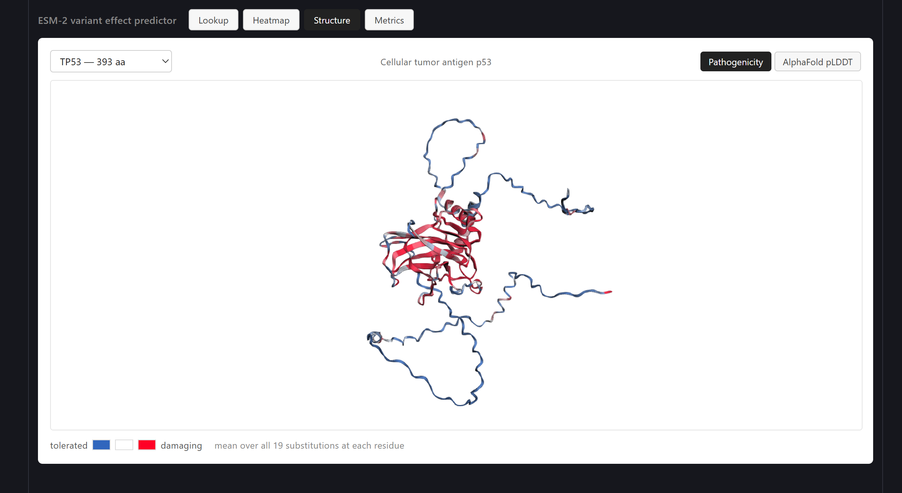
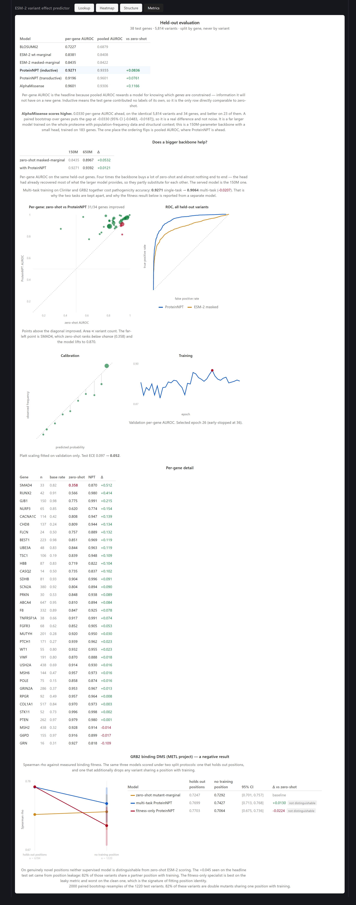

# Prism - ESM-2 variant effect predictor

[](https://github.com/st44rplatinum/prism/actions/workflows/tests.yml)

Predicts whether a missense variant is pathogenic, using a protein language
model (ESM-2) with a ProteinNPT head trained on ClinVar labels. Ships a FastAPI
service and a Vue front end: per-gene saturation maps, an AlphaFold structure
view, and a held-out evaluation dashboard.

Held-out per-gene AUROC **0.927**, against 0.844 for zero-shot ESM-2 and 0.723
for BLOSUM62, on 34 genes the model never saw during training. AlphaMissense,
scored on the identical variants, gets **0.960** - see
[the comparison](docs/GUIDE.md#alphamissense-beats-it).

> **Research prototype.** Trained on 183 genes on a 4 GB GPU. Not a clinical
> tool — no medical decision should rest on it.

---

## Lookup

Type a gene and one or more substitutions, get a calibrated probability with the
ClinVar label beside it.



Every view is addressable, so a result is a link:
`?view=lookup&gene=TP53&variant=R175H`.

## Saturation map

Every possible substitution at every residue, coloured by predicted
pathogenicity. TP53 below: the disordered N-terminal domain is tolerant, the
DNA-binding core is not.



## Structure

The same per-residue scores painted onto the AlphaFold model, with a toggle for
AlphaFold's own pLDDT confidence.



## Evaluation

Genes are split whole, never by variant, so a test gene contributes no labels of
its own.



## What no predictor here can do

Every model on that table, AlphaMissense included, outputs one number. One
number cannot say *which* disease.

In SCN5A, gain-of-function variants cause long QT syndrome and loss-of-function
variants cause Brugada syndrome. Opposite mechanisms, opposite treatment, same
gene, and both are "pathogenic". AlphaMissense tells them apart at **AUROC
0.503** - chance - while scoring 0.960 on pathogenicity itself. Sequence
position alone does better (0.708).

Across eight such within-gene contrasts, no pathogenicity score beat a plain
positional baseline.

### And there is very little data to fix it with

I scanned all of ClinVar to find out how big this problem even is:

| | |
|---|---|
| pathogenic missense variants | 84,359 |
| genes | 3,564 |
| genes with two phenotypes, 30+ variants each | **25** |
| of those, a genuinely different disease rather than two names for one | **~8** |

Most of the 25 are the same condition written twice - Lynch syndrome vs
hereditary nonpolyposis colorectal cancer, Kabuki syndrome vs Kabuki syndrome 1,
familial hypercholesterolemia vs hypercholesterolemia familial 1. The ones that
are real: ATM, DYSF, NEB, SACS, USH2A, FBN1, NF1, ABCA4.

Eighteen of the 25 are already in this 183-gene panel, so a bigger panel does
not help. The limit is ClinVar, not the gene list.

So there is no training set here. Roughly eight usable contrasts with a few
dozen variants each is enough to show that current predictors cannot do this,
and not enough to build something that can.

```bash
python -m vep.eval.survey        # the scan above
python -m vep.eval.mechanism     # scores each contrast
```

---

## Quick start

```bash
# PyPI's default torch wheel is CPU-only. With an NVIDIA GPU, install the CUDA
# build first or everything below runs ~30x slower.
pip install torch --index-url https://download.pytorch.org/whl/cu118
pip install transformers pandas numpy scikit-learn scipy h5py pyarrow pyyaml fastapi uvicorn requests pytest
python -m vep.esm.cache          # per-residue features, ~2 min on a GPU
uvicorn api.main:app --port 8000
```

```bash
cd "front end/web" && npm install && npm run dev
```

The trained head, the parsed ClinVar data, the zero-shot scores and the
precomputed saturation maps are all committed, so nothing needs retraining and
the only setup step is the feature cache.

## Notes

- Run from a clean clone, not just from my machine: install, feature cache in
  2.1 min on a GTX 1050 Ti, then `/predict` returns calibrated probabilities.
  TP53 R175H 0.935, P72R 0.089, R273H 0.932.
- `pip install torch` gives a CPU-only wheel. Without the CUDA build the
  feature cache goes from ~2 min to about an hour.
- ~55 MB of artefacts are committed so nothing has to be retrained. Only the
  250 MB feature cache is built locally, and it is the one thing that is not.
- The API works without the trained head too - it falls back to zero-shot LLR
  and reports `model_available: false` rather than failing.
- Zero-shot barely separates the two TP53 examples above (LLR -8.65 vs -6.69).
  The head is what turns that into 0.935 vs 0.089.

**[Full documentation → `docs/GUIDE.md`](docs/GUIDE.md)** — results, methods,
rebuild instructions, and the design decisions that are not obvious from the
code.

## License

[MIT](LICENSE). The committed model weights and parsed data derive from
ClinVar (public domain), UniProt (CC BY 4.0) and ESM-2 (MIT) — see
[`docs/GUIDE.md`](docs/GUIDE.md#data-sources) for attribution.
